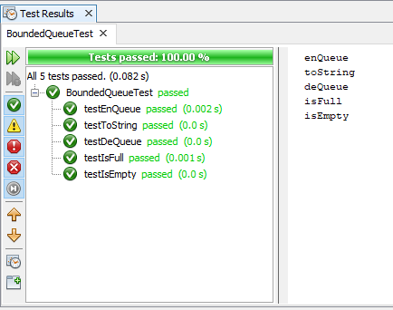

# **Question:** 
Develop JUnit tests for the BoundedQueue class. A compilable version is available on the book website in the file BoundedQueue.java. Make sure your tests check every method, but we will not evaluate the quality of your test designs and do not expect you to satisfy any test criteria. Turn in a printout of your JUnit tests and either a printout or a screen shot showing the results of each test.

# **Answer:**
Mã nguồn: 
```java
// Introduction to Software Testing
// Authors: Paul Ammann & Jeff Offutt
// Chapter 3, page ??
// See BoundedQueueTest.java for JUnit tests. (Instructor only)

public class BoundedQueue
{ 
   // Overview:  a BoundedQueue is a mutable, bounded FIFO data structure
   // of fixed size , with size being set in the constructor
   // A typical Queue is [], [o1], or [o1, o2], where neither o1 nor o2
   // are ever null.  Older elements are listed before newer ones.

   private final Object[] elements;
   private int size, front, back;
   private final int capacity;

   public BoundedQueue (int capacity)
   {
      if (capacity < 0)
         throw new IllegalArgumentException ("BoundedQueue.constructor");
      this.capacity = capacity;
      elements = new Object [capacity];
      size  = 0; front = 0; back  = 0;
   }

   public void enQueue (Object o)
      throws NullPointerException, IllegalStateException
   {  // Modifies: this
      // Effects:   If argument is null throw NullPointerException
      // else if this is full, throw IllegalStateException,
      // else make o the newest element of this
      if (o == null)
         throw new NullPointerException ("BoundedQueue.enQueue");
      else if (size == capacity)
         throw new IllegalStateException ("BoundedQueue.enQueue");
      else
      {
         size++;
         elements [back] = o;
         back = (back+1) % capacity;
      }
   }
   
   public Object deQueue () throws IllegalStateException
   {  // Modifies: this
      // Effects:   If queue is empty, throw IllegalStateException,
      // else remove and return oldest element of this
   
      if (size == 0)
         throw new IllegalStateException ("BoundedQueue.deQueue");
      else
      {
         size--;
         Object o = elements [ (front % capacity) ];
         elements [front] = null;
         front = (front+1) % capacity;
         return o;
      }
   }
   
   public boolean isEmpty()
   { 
      return (size == 0); 
   }
   public boolean isFull() 
   { 
      return (size == capacity); 
   }
   
   public String toString()
   {
      String result = "[";
      for (int i = 0; i < size; i++)
      {
         result += elements[ (front + i) % capacity ] . toString();
         if (i < size -1) {
            result += ", ";
         }
      }
      result += "]";
      return result;
   }
   
}
```
Code chạy test:
```java
public class BoundedQueueTest {
    /**
     * Test of enQueue method, of class BoundedQueue.
     */
    @Test
    public void testEnQueue() {
        System.out.println("enQueue");
        Object o = 1;
        BoundedQueue instance = new BoundedQueue(5);
        instance.enQueue(o);
        
        assertEquals(instance.toString(), "[1]");
    }

    /**
     * Test of deQueue method, of class BoundedQueue.
     */
    @Test
    public void testDeQueue() {
        System.out.println("deQueue");
        Object o = 1;
        Object a = 2;
        BoundedQueue instance = new BoundedQueue(5);
        instance.enQueue(o);
        instance.enQueue(a);
        instance.deQueue();
        
        assertEquals(instance.toString(), "[2]");
    }

    /**
     * Test of isEmpty method, of class BoundedQueue.
     */
    @Test
    public void testIsEmpty() {
        System.out.println("isEmpty");

        BoundedQueue instance = new BoundedQueue(5);

        assertEquals(instance.isEmpty(), true);
    }

    /**
     * Test of isFull method, of class BoundedQueue.
     */
    @Test
    public void testIsFull() {
        System.out.println("isFull");
        Object a = 1;
        BoundedQueue instance = new BoundedQueue(5);
        instance.enQueue(a);
        instance.enQueue(a);
        instance.enQueue(a);
        instance.enQueue(a);
        instance.enQueue(a);

        assertEquals(instance.isFull(), true);
    }

    /**
     * Test of toString method, of class BoundedQueue.
     */
    @Test
    public void testToString() {
        System.out.println("toString");
        Object o = 1;
        Object a = 2;
        Object b = 4;
        BoundedQueue instance = new BoundedQueue(5);
        instance.enQueue(a);
        instance.enQueue(b);
        instance.enQueue(o);
        assertEquals(instance.toString(), "[2, 4, 1]");
    }
}
```

Kết quả chạy test:

 
