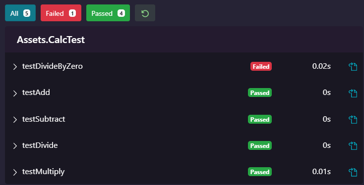
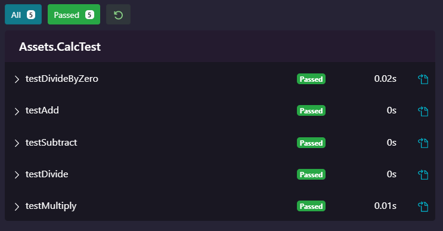

### Đầu tiên em tạo bộ kiểm thử cho Calc.java (Calc.java được lấy ở website của sách, Calc.java gốc chỉ có hàm add(): Cộng 2 số nguyên cho trước): 
```
package Assets;

import static org.junit.Assert.assertThrows;
import static org.junit.jupiter.api.Assertions.assertEquals;
import static org.junit.jupiter.api.Assertions.assertTrue;

import org.junit.After;
import org.junit.Before;
import org.junit.jupiter.api.Test;

/**
 * CalcTest
 */
public class CalcTest {
  Calc calc;

  @Before
  public void setUp() {
    calc = new Calc();
  }

  @After
  public void delete() {
    calc = null;
  }

  @Test
  public void testAdd() {
    assertEquals(4, calc.add(3, 1));
  }
  @Test
  public void testSubtract() {
    assertEquals(5, calc.subtract(11, 6));
  }
  @Test
  public void testMultiply() {
    assertEquals(16, calc.multiply(2, 8));
  }
  @Test
  public void testDivide() {
    assertEquals(8, calc.divide(64, 8));
  }
  @Test
  public void testDivideByZero() {
    assertThrows(ArithmeticException.class, () -> {
      calc.divide(9, 0);
    });
  }
}
```
### Kết quả bộ kiểm thử sau khi đã thêm các tính năng trên: 


### Tuy nhiên, còn một bộ kiểm thử còn lỗi: hàm ```divide()``` chưa xử lý trường hợp chia cho số 0. Em sửa hàm đó như sau:
```
static public int divide(int a, int b)
{
   if (b == 0) throw new ArithmeticException("/ by zero");
   return a / b;
}
``` 
### Và kết quả của bộ kiểm thử: 
