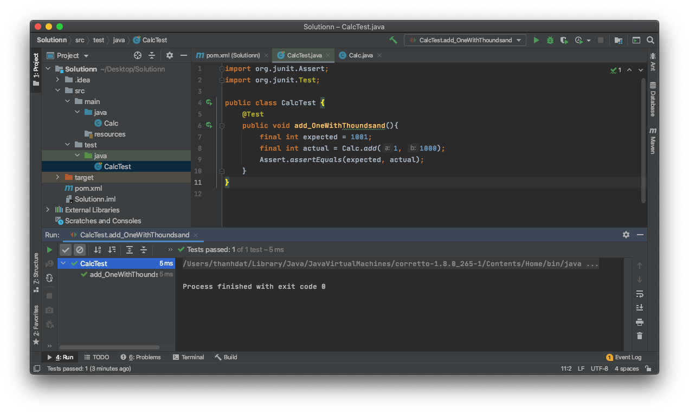
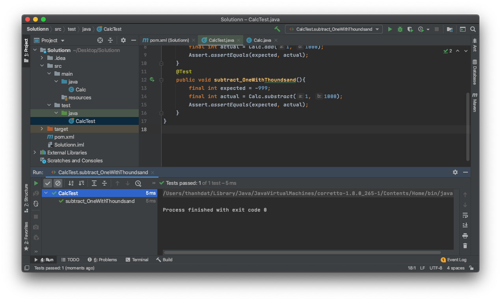
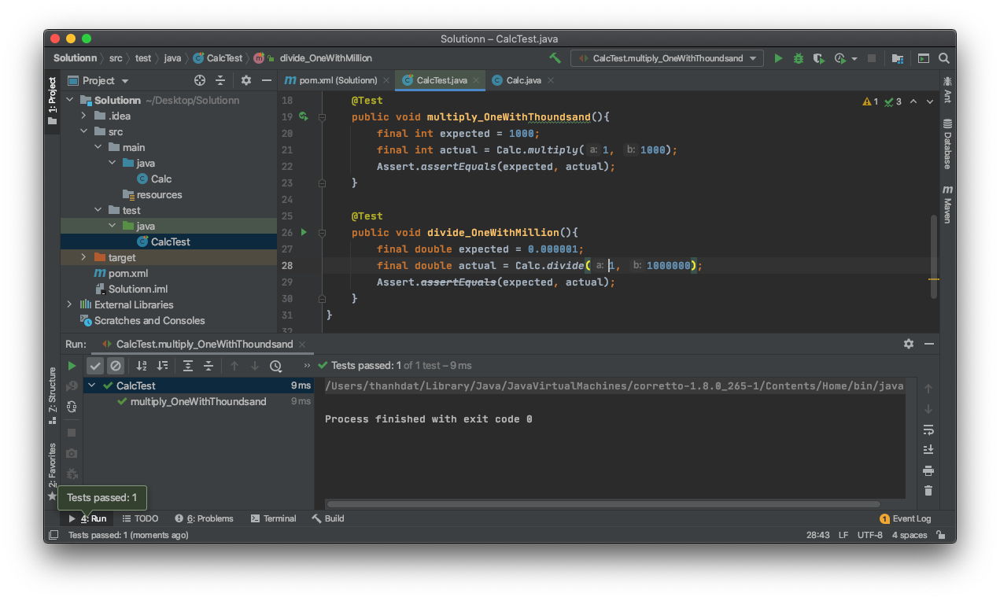
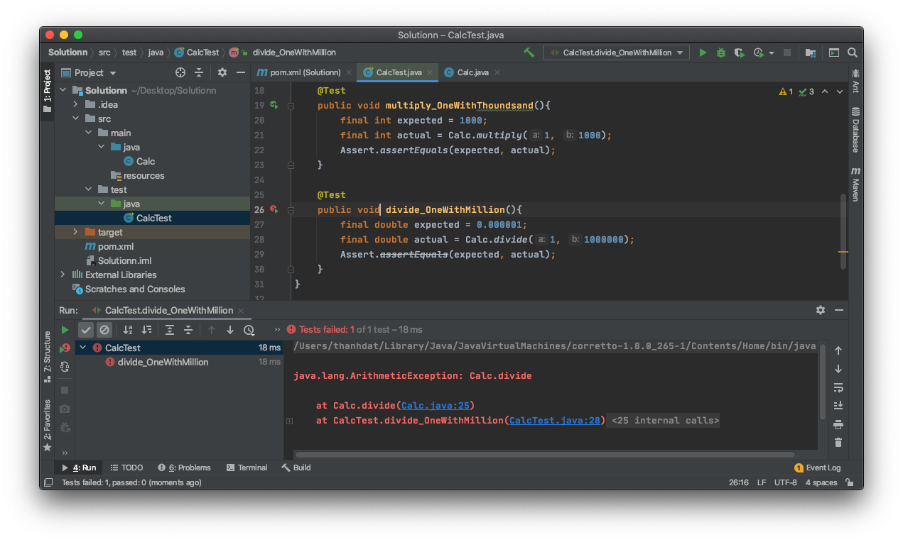

# **Question:** 
Chapter 3 contained the program Calc.java. It is available on the program listings page on the book website.
Calc currently implements one function: it adds two integers. Use test-driven design to add additional functionality to subtract two integers, multiply two integers, and divide two integers. First create a failing test for one of the new functionalities, modify the class until the test passes, then perform any refactoring needed. Repeat until all of the required functionality has been added to your new version of Calc, and all tests pass.
Remember that in TDD, the tests determine the requirements. This means you must encode decisions such as whether the division method returns an integer or a floating point number in automated tests before modifying the software.
Submit printouts of all tests, your final version of Calc, and a screenshot showing that all tests pass. Most importantly, include a narrative describing each TDD test created, the changes needed to make it pass, and any refactoring that was necessary.

**Dịch**
> Chương 3 có đính kèm chương trình Calc.java Nó có sẵn trên website của cuốn sách. Chương trình Calc thực hiện một phương thức, nó thêm 2 số nguyên. Sử dụng thiết kế hướng kiểm thử để thêm chức năng trừ, nhân, chia 2 số nguyên tố đó. Trước tiên, hãy tạo một bài kiểm tra không đạt cho một trong các chức năng mới, sửa đổi lớp cho đến khi bài kiểm tra vượt qua, sau đó thực hiện bất kỳ cấu trúc lại nào cần thiết. Lặp lại cho đến khi tất cả các chức năng cần thiết đã được thêm vào phiên bản Calc mới của bạn và tất cả các bài kiểm tra đều vượt qua.
Hãy nhớ rằng trong TDD, các bài kiểm tra xác định các yêu cầu. Điều này có nghĩa là bạn phải mã hóa các quyết định chẳng hạn như phương pháp chia trả về số nguyên hay số dấu phẩy động trong các bài kiểm tra tự động trước khi sửa đổi phần mềm.
Gửi bản in của tất cả các bài kiểm tra, phiên bản Calc cuối cùng của bạn và ảnh chụp màn hình cho thấy rằng tất cả các bài kiểm tra đều vượt qua. Quan trọng nhất, bao gồm một bản tường thuật mô tả mỗi bài kiểm tra TDD được tạo, những thay đổi cần thiết để làm cho nó vượt qua và bất kỳ cấu trúc lại nào cần thiết.

# **Answer**
```//Calc.java Lấy từ website```

```java
// Introduction to Software Testing
// Authors: Paul Ammann & Jeff Offutt
// Chapter 3; page ??
// See CalcTest.java, DataDrivenCalcTest.java for JUnit tests

public class Calc
{
   static public int add (int a, int b)
   {
      return a + b;
   }
}
```

```//Calc.java hoàn thiện```
```java
// Introduction to Software Testing
// Authors: Paul Ammann & Jeff Offutt
// Chapter 3; page ??
// See CalcTest.java, DataDrivenCalcTest.java for JUnit tests

public class Calc
{
    static public int add (int a, int b)
    {
        return a + b;
    }

    static public int substract(int a, int b)
    {
        return a - b;
    }

    static public int multiply(int a, int b) {
        return a * b;
    }

    static public int divide(int a, int b) {
        if(b == 0) throw new ArithmeticException("Divided is Zero");
        int c = a / b;
        if(a != 0 && c == 0) throw new ArithmeticException("Over Bit");

        return c;
    }
}
```

Ghi chú:
- Em đã thêm việc xử lý ngoại lệ để tránh trường hợp số bị chia là số 0 dẫn đến ngoại lệ chia 0 trong toán học
- Và thêm một trường hợp ném ngoại lệ là số chia nhỏ hơn nhiều số bị chia dẫn đến bit không thể bao trọn được số và kết quả chia là số 0
(VD: là 1 chia 1.000.000.000 đáng lẽ là 0.0000000001 nhưng sẽ bị trả về 0)


CalcTest.java (Kiểm thử cho phương thức add())


CalcTest.java (Kiểm thử cho phương thức subtract())


CalcTest.java (Kiểm thử cho phương thức multiply())


CalcTest.java (Kiểm thử cho phương thức divide() -> thất bại và trả về ngoại lệ Over Bit)
