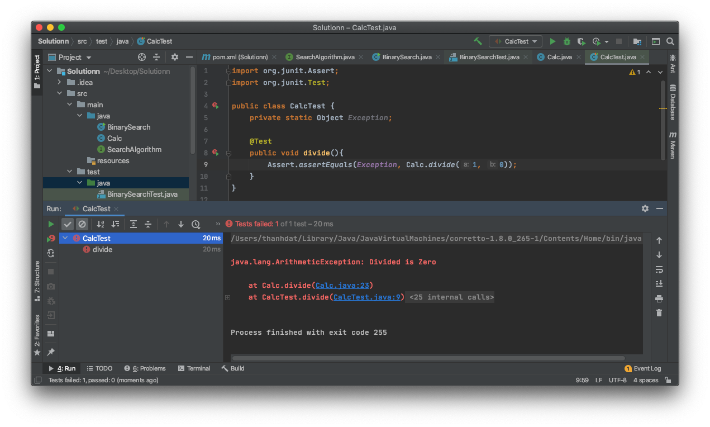

# **Question:**
Repair a fault in an existing system. That is, find the code that needs to change and capture the current behavior with tests. At least one of these tests must fail, thus demonstrating that you found the fault. Repair the fault and check that all of your tests now pass.

**<h2>Dịch</h2>**
> Sửa một lỗi trong hệ thống sẵn có

# **Answer:**

```//Calc.java Lấy từ website```

```java
// Introduction to Software Testing
// Authors: Paul Ammann & Jeff Offutt
// Chapter 3; page ??
// See CalcTest.java, DataDrivenCalcTest.java for JUnit tests

public class Calc
{
   static public int add (int a, int b)
   {
      return a + b;
   }
}
```

```//Calc.java hoàn thiện```
```java
// Introduction to Software Testing
// Authors: Paul Ammann & Jeff Offutt
// Chapter 3; page ??
// See CalcTest.java, DataDrivenCalcTest.java for JUnit tests

public class Calc
{
    static public int add (int a, int b)
    {
        return a + b;
    }

    static public int substract(int a, int b)
    {
        return a - b;
    }

    static public int multiply(int a, int b) {
        return a * b;
    }

    static public int divide(int a, int b) {
        if(b == 0) throw new ArithmeticException("Divided is Zero");
        int c = a / b;
        if(a != 0 && c == 0) throw new ArithmeticException("Over Bit");

        return c;
    }
}
```
Calc.java hoàn thiện em đã thêm việc xử lý ngoại lệ để tránh phát sinh lỗi mà không kiểm soát được

## **Trường hợp chia 0**
